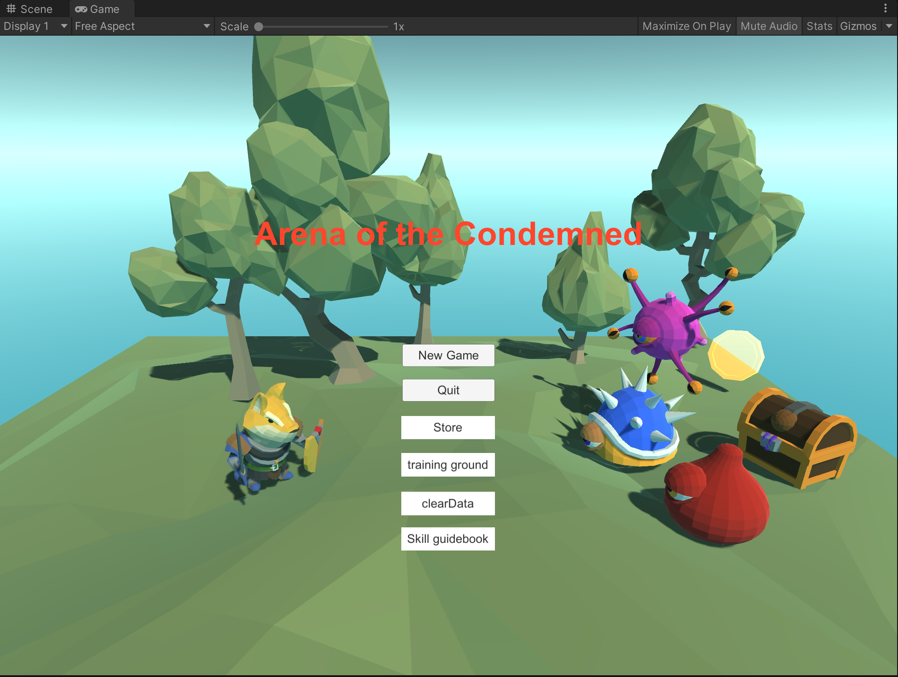
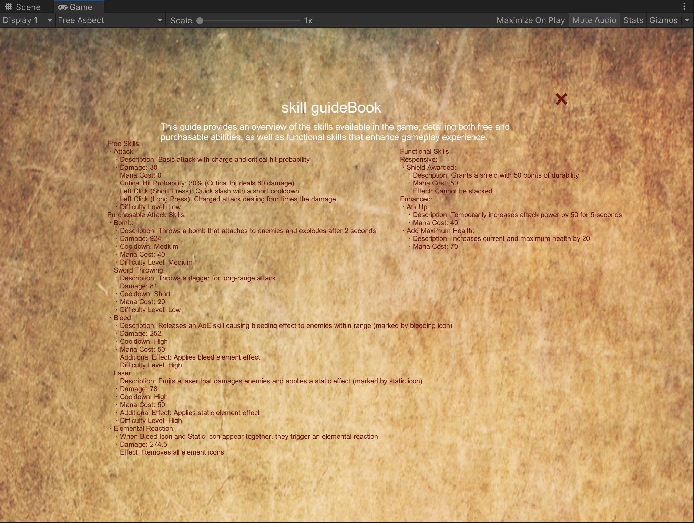
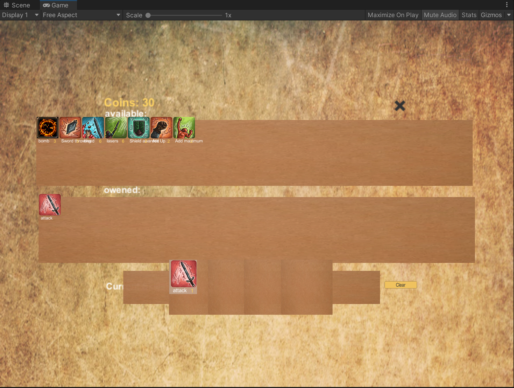
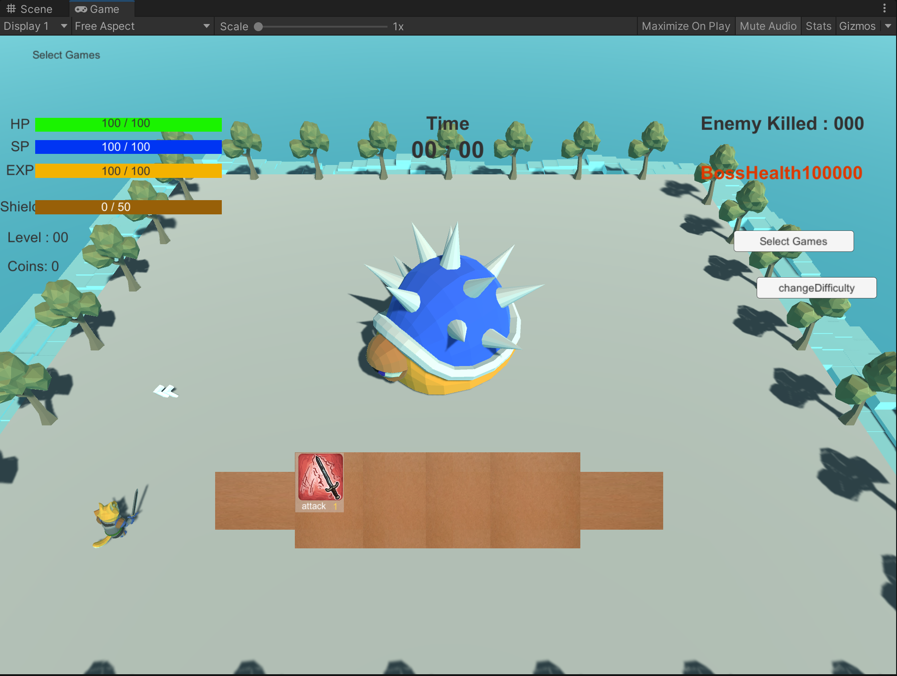
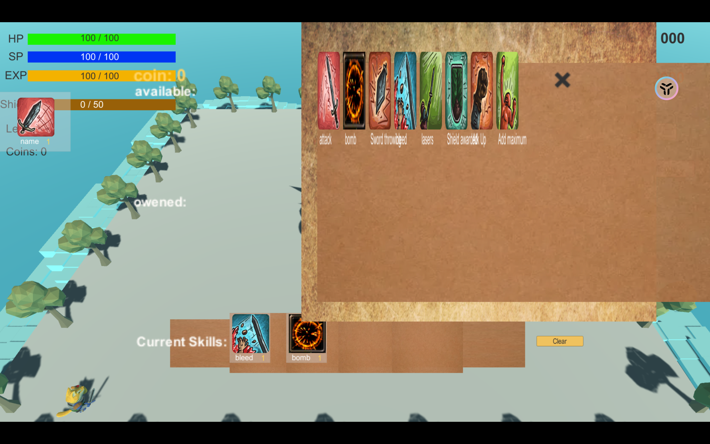
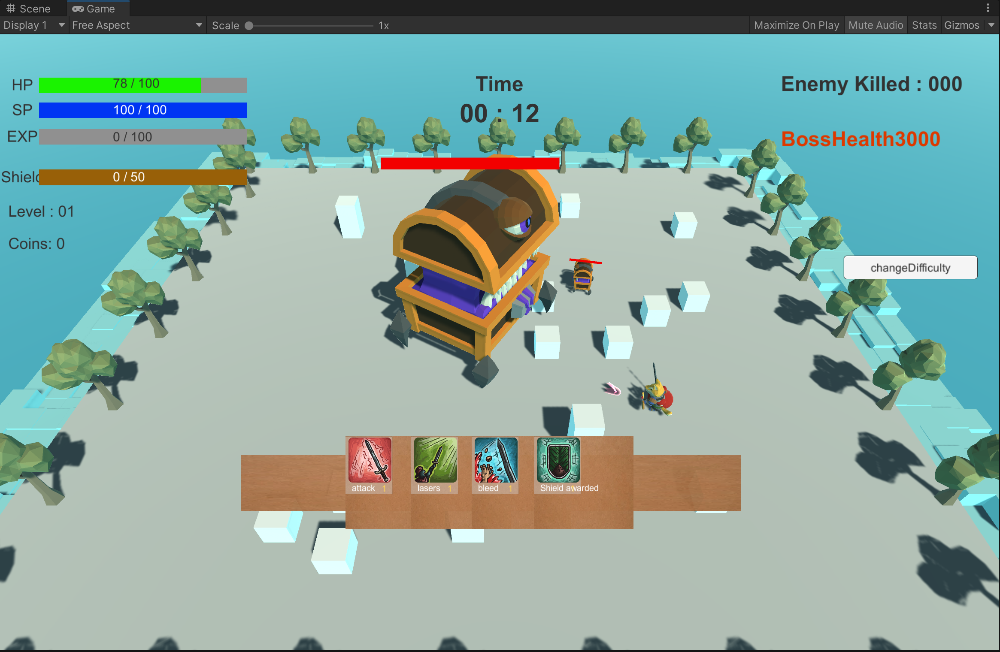
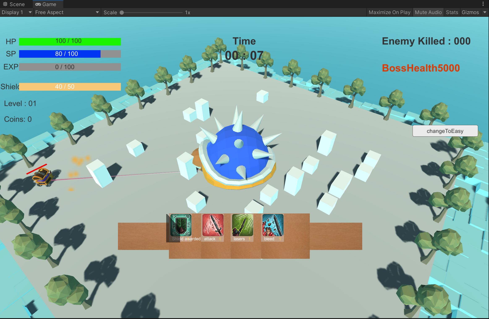

# 🎮 3D Unity 游戏项目

## 项目简介

课程：CPT306 Individual Project 
Coursework Assignment Specification 
2023/24 Semester 2 
Bachelor's Degree – Year 4 

✨ 欢迎来到我们的3D游戏项目！在这个项目中，玩家被迫进入一个危险的角斗场，需要通过击败强大的敌人来获得自由。这个游戏结合了精美的画面、流畅的操作和多样的技能系统，为玩家带来极致的游戏体验。

## 游戏特性

### 🌍 游戏场景

- **地图大小**: 31 x 31 单位的大型地图，提供广阔的战斗空间。
- **随机障碍物**: 20个随机生成的障碍物，增加游戏的挑战性和策略性。
- **障碍物类型**: 高度为1或2单位的方形障碍物，形状自由设计，但必须符合尺寸要求。
- **Boss位置**: 固定在地图中心的强大Boss，尺寸为5 x 5 x 5单位。

### 👾 角色设计

- **Boss**: 游戏中的终极敌人，无法移动，但拥有强大的技能和高生命值。
- **Hero**: 玩家控制的角色，尺寸为1 x 1 x 1单位，可以在地图上自由移动并释放各种技能。

### 📸 摄像机系统

- **中心对准**: 摄像机始终对准地图中心的Boss，确保玩家能时刻关注战场的核心。
- **旋转视角**: 通过按住Q键和E键，玩家可以分别顺时针和逆时针旋转视角，获得更好的战斗视野。

## 🕹️ 用户界面和游戏玩法

- **血量显示**: 清晰显示Boss和Hero的血量，让玩家随时掌握战斗状态。
- **技能显示**: 清晰显示当前选择的技能和技能冷却时间，方便玩家策略性使用技能。
- **提示信息**: 在Hero获胜或失败后正确显示提示信息，提供及时的反馈。

## 🏋️ 训练场

- **训练场设计**: 从主菜单进入训练场，训练场只包含Hero和Boss。
- **高血量Boss**: Boss无技能但拥有高生命值，供玩家测试技能。
- **自由选择技能**: 玩家可以随时选择并释放任何技能进行测试，提升自己的操作水平和技能理解。

## 🎵 其他功能

- **背景音乐和音效**: 为游戏添加了动感的背景音乐和逼真的音效，提升游戏体验。
- **难度选择**: 玩家可以选择不同的难度，挑战自我。
- **随机Boss技能和外观**: 增加游戏的多样性和趣味性。
- **技能指南手册**: 提供详细的技能说明和使用指南，帮助玩家更好地掌握游戏。

## 开发与技术细节

- **开发平台**: 使用Unity和C#进行开发，确保游戏的稳定性和性能。
- **游戏逻辑**: 所有的游戏逻辑和代码均由开发团队独立编写，保证原创性和独特性。
- **素材来源**: 游戏中的纹理、模型和动画部分使用了网络素材，并进行适当修改以适应游戏需求。

希望大家能享受这个充满挑战和乐趣的3D游戏！🎉

# 🛠️ 技能指引书

## 免费技能

### Attack
- **描述**: 普通攻击，长按蓄力，概率暴击
- **伤害**: 30
- **蓝量消耗**: 0
- **暴击概率**: 30%（暴击造成60伤害）
- **左键短按**: 快速劈砍，冷却时间短
- **左键长按**: 蓄力攻击，造成四倍伤害
- **难度级别**: 低

## 购买攻击技能

### Bomb
- **描述**: 投掷一个炸弹，附加在敌人身上，2秒后爆炸
- **伤害**: 924
- **冷却时间**: 中
- **蓝量消耗**: 40
- **难度级别**: 中

### Sword Throwing
- **描述**: 投掷一把短剑进行远程攻击
- **伤害**: 81
- **冷却时间**: 短
- **蓝量消耗**: 20
- **难度级别**: 低

### Bleed
- **描述**: 释放范围AOE技能，给范围内的敌人添加流血效果（流血标志）
- **伤害**: 252
- **蓝量消耗**: 50
- **额外效果**: 附加流血元素效果
- **难度级别**: 高

### Laser
- **描述**: 发射激光攻击敌人，并附加静电效果（静电标志）
- **伤害**: 78
- **蓝量消耗**: 50
- **额外效果**: 附加静电元素效果
- **难度级别**: 高

### 元素反应
- 当 **流血标志** 和 **静电标志** 同时存在时，会触发元素反应：
    - **伤害**: 274.5
    - **效果**: 消除所有元素标志

## 功能型技能

### Responsive

#### Shield Awarded
- **描述**: 获得一个50点盾量的护盾
- **蓝量消耗**: 50
- **效果**: 不可叠加

### Enhanced

#### Atk Up
- **描述**: 在5秒内增加50点攻击力
- **蓝量消耗**: 40

#### Add Maximum Health
- **描述**: 增加当前血量和最大血量20点
- **蓝量消耗**: 70

## ✨ 图片预览

- <figure>
  
  <figcaption>主界面</figcaption>
</figure>

- <figure>
  
  <figcaption>技能介绍书</figcaption>
</figure>

- <figure>
  
  <figcaption>技能商店及装配(持久化到本地)</figcaption>
</figure>

- <figure>
  
  <figcaption>BOSS训练场</figcaption>
</figure>

- <figure>
  
  <figcaption>训练场试用技能(不会保存到本地)</figcaption>
</figure>

- <figure>
  
  <figcaption>BOSS战(简单难度)</figcaption>
</figure>

- <figure>
  
  <figcaption>BOSS战(困难难度)</figcaption>
</figure>

